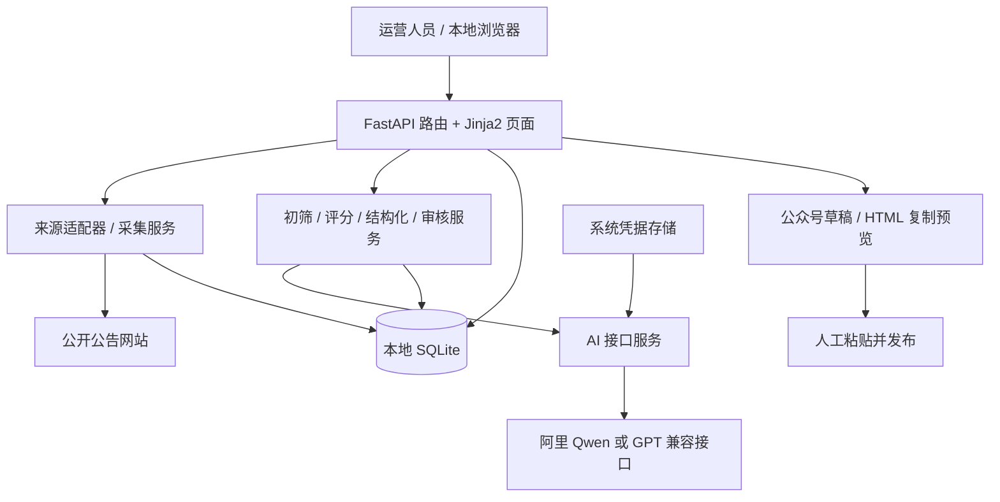
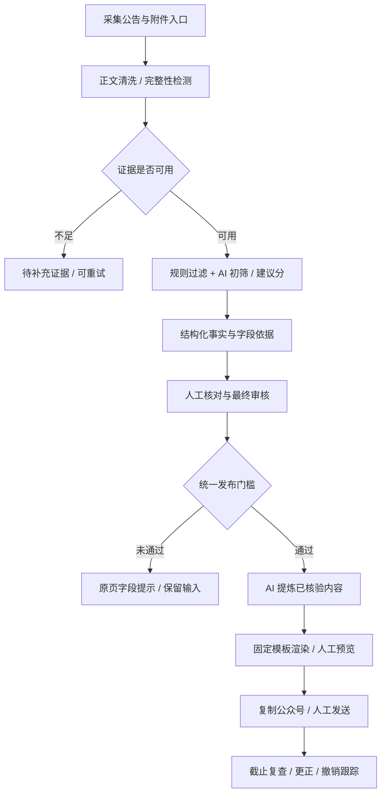

# 系统架构说明

日期：2026-09-05  
范围：现有本地招聘内容系统及下一轮目标架构。第一轮 P0/P1 能力已完成代码实现；实际运营验收仍待执行。  
实施顺序：[IMPLEMENTATION_PLAN.md](IMPLEMENTATION_PLAN.md)

## 1. 产品边界

面向上海大学生和毕业两年内青年的非官方就业信息服务。系统辅助发现、整理、审核及制作招聘内容，不代表校方或招聘单位，不代替官方报名入口。

自动处理内部信息；人工决定是否通过和发布。微信公众号采用预览复制方式，个人微信群由运营人员发送。代码同步到 GitHub 不等于共享数据库或自动部署。

## 2. 当前架构

系统采用本地单体应用，暂不需要微服务、Redis 或独立集群。

浏览器不应直接持有模型密钥。配置页面提交到本地后端，由服务端调用模型。当前使用系统凭据存储管理密钥；数据库保留配置和脱敏信息。

## 3. 模块职责

| 模块 | 当前主要位置 | 职责 |
|---|---|---|
| 页面与路由 | `app/main.py`、`app/templates/`、`app/static/` | 表单、列表、反馈、调用服务 |
| 来源采集 | `app/sources/`、`services/real_collection.py` | 按来源获取公告、去重和更新 |
| 来源治理 | `collection_strategy.py`、`source_health.py`、`source_library.py` | 频率、健康状态、来源库 |
| 初筛与适配 | `intake_screening.py`、`notice_classification.py`、`student_fit.py` | 区分招聘通知、目标人群及优先级 |
| AI 建议分 | `ai_scoring.py` | 建议排序及理由，不代替审批 |
| 结构化 | `ai_structuring.py`、`structuring.py`、`attachment_parser.py` | 提取事实、表单核对、附件处理 |
| 审核与安全 | `reviews.py`、`jobs.py`、`deadline_policy.py`、`publication_safety.py` | 准入、时效、人工审批和日志 |
| 内容交付 | `ai_content_draft.py`、`distribution.py` | 内容提炼、渠道草稿和固定模板 |
| 配置与存储 | `ai_settings.py`、`models.py`、`database.py` | 模型配置、实体、数据库初始化 |

上表服务文件位于 `app/services/`。来源库中登记的企业不等于全部已经有稳定可用的采集适配器；支持情况需按来源实测。

## 4. 当前与目标的区别

| 层面 | 当前情况 | 下一轮目标 |
|---|---|---|
| 证据 | 已保存原文片段，部分适配器整页聚合或截断 | 正文完整性、附件状态、字段证据可追溯 |
| 字段 | 部分返回值字符串化，岗位与公告容易混用 | 类型规范化、公告/岗位分离、缺失原因明确 |
| 评分 | 已分离 AI 建议分和人工分 | 发布时间与工作地点按证据计分 |
| 核验 | 有结构化核验清单和发布校验 | 所有出口共用门槛，核验与事实版本绑定 |
| 批处理 | 小批次同步请求 | 持久批次、逐条状态、防重和失败重试 |
| 成稿 | 已有 AI 内容服务和复制页 | 模型只生成内容，全部渠道预览使用统一版本模板 |
| 协作 | GitHub 代码共享、本地启动脚本 | 干净安装实测、版本可见、错误可操作 |

## 5. 目标处理流程

“入库前初筛”指进入正式运营待处理池前筛选。原始线索和排除原因仍应保留供追溯，不等于无痕删除。模型不可用时标记待处理或规则降级，不假装已做 AI 审核。

## 6. 数据设计

当前主要实体：

- `Source`：来源配置、健康状态和采集策略。
- `Job`：公告/岗位事实、证据、状态、版本、初筛等级、建议分及人工分。
- `ReviewLog`：人工或系统动作及说明。
- `DistributionItem`：渠道内容、AI 内容与发送状态。
- `TaskRun`：任务执行记录；当前不等于完整后台任务队列。
- `AiProviderSetting`：模型与接口配置、测试状态，不保存明文密钥。

拟新增或完善的数据契约：

| 数据 | 关键内容 | 用途 |
|---|---|---|
| 证据记录 | 来源 URL、正文、附件、提取状态、内容摘要哈希、各类时间 | 说明 AI 读了什么、是否完整 |
| 字段依据 | 字段值、证据片段、来源、明确/分类/未知状态 | 避免推断冒充事实 |
| 核验版本 | 事实版本、核验项、审核人、核验时间 | 防止修改后沿用旧审批 |
| 草稿版本 | 事实版本、模板版本、模型、生成状态、人工编辑状态 | 防止旧稿误发布与人工内容被覆盖 |
| 批次及子任务 | 批次 ID、记录版本、状态、重试次数、耗时、错误类别 | 逐条进度、防重、失败恢复 |

优先通过现有 SQLite 增量迁移实现；是否拆表以查询和审计需要决定，不为架构复杂度增加系统负担。

## 7. 四类状态不能混在一起

1. **证据状态**：正文完整、待附件、访问失败等，描述材料是否可用。
2. **初筛等级**：A 优先核验、B 常规核验、C 信息不足或适配待定、D 明显不适配/非开放招聘；必须附理由，不代表审批结论。
3. **建议分状态**：待建议、AI 建议、规则降级、失败，描述处理方式；分数不是已核验的证明。
4. **业务状态**：待核验、待审核、可发布、已截止、已撤销等，控制能执行的操作。

内容生成成功不等于发送成功；人工审核通过也不能保证后续仍在招聘。生成和复制前需重新执行时效及版本校验。

## 8. 规则与 AI 的分工

确定性规则负责日期比较、类型校验、必填条件、重复任务、权限、状态转换和发布阻断。AI 负责语义抽取、分类辅助、建议理由及内容提炼。

- 原文未写截止日期：记录未知，不能虚构日期，也不直接判为过期。
- 来源属于上海：不能直接推断岗位工作地在上海。
- 资格条件是原文事实，目标群组是运营分类；“学生可能感兴趣”不代表符合报考资格。
- 多岗位公告按岗位关联要求，不能将某岗位的“应届可投”扩展给全部岗位。
- 网页和附件属于待处理资料，其中的指令不得改变系统提示词、权限或发布规则。
- 不向模型发送 API Key、内部凭据或不必要的个人信息；第三方模型服务只能获得任务所需材料。

## 9. 交互、任务与故障设计

拟统一提交反馈契约：成功标志、简短消息、字段错误列表、任务 ID（如适用）、下一步动作。网页表单不直接跳转展示原始 JSON 错误。

- 提交中禁用重复按钮，成功/失败/超时都结束加载；失败保留填写内容并定位首个错误字段。
- 模型错误区分配置缺失、鉴权失败、额度/限流、网络超时、格式错误，日志脱敏。
- 本地单进程先采用持久任务记录配合有限执行器；不提前引入分布式任务平台。
- 子任务按“任务类型 + 记录 ID + 事实版本 + 配置版本”防重；失败重试须明确可重试类型和次数。
- 进程退出不承诺任务继续运行；重新启动识别中断任务，允许恢复或明确重试。
- 附件只访问允许的公开来源，限制大小、超时、类型和跳转目标，避免抓取本地或内网资源。

## 10. 运行、升级与验收边界

GitHub 同步代码与说明；各电脑独立配置密钥、依赖和本地数据。不提交数据库、凭据、日志、虚拟环境及个人运行配置；每次同步前检查实际跟踪文件。

升级流程：备份数据 → 拉取指定版本 → 更新依赖与迁移 → 重启 → 页面核对版本 → 执行关键流程检查。只刷新网页不能保证 Python 后端已更新。

本轮验证包含单元测试、临时数据库集成测试、代表性公告端到端测试、少量真实模型测试及干净克隆启动测试。尚未实测的附件类型、操作系统和公众号粘贴效果必须标为未验证。

最终方向：先做可信、可解释、便于人工确认的内容工作台，再扩大来源和处理量；不能用更大的模型掩盖原文缺失或发布门槛问题。
