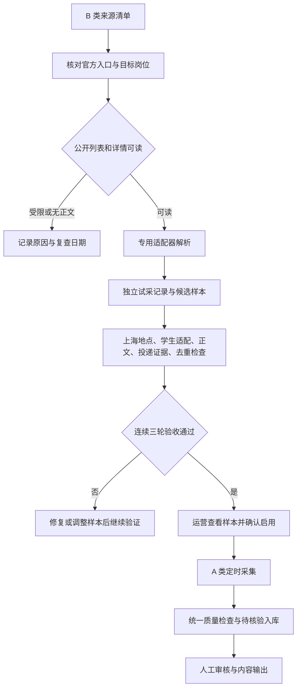

# B 类招聘来源抓取逻辑与分阶段实施方案

日期：2026-09-11。状态：方案已整理，业务代码尚未按本方案实施。

**目标：**将 B 类来源逐步转成稳定提供上海学生就业信息的渠道；每次接入都能说明抓到了什么、为何保留或排除、是否达到正式启用条件。

**架构：**沿用 FastAPI 单体、现有来源适配器、规则初筛和人工审核流程。本地使用 SQLite，多人云端兼容既有 PostgreSQL、账号权限与任务队列。不引入 LangChain、Redis 或新的采集微服务。

**执行方式：**实施人员使用 executing-plans 技能逐阶段执行，每阶段运行针对性测试并更新本文复选框。本文提供逻辑契约与验收框架，实施时以当前代码的实际接口为准。文件路径均相对项目根目录 `D:\黄药师 AI招聘项目\网页`。

## 1. 当前事实与需要更正的口径

本次只核对本地代码、数据库及历史验证报告，未重新请求外部招聘站点。

| 口径 | 本次核对结果 | 含义 |
|---|---:|---|
| 官方来源目录 | 80 个 | A 6、B 33、C 21、D 20 |
| 数据库来源行数 | 88 行 | 包含额外 8 个演示来源，不能全部当真实渠道 |
| B 类已有专用适配器 | 3 个 | 交大、上财、NCSS；均禁用 |
| B 类其余来源 | 30 个 | 多数仅登记入口，需逐个调查 |
| A 类配置启用 | 6 个 | 其中浦发当前暂停，日常任务会跳过 |

更正此前说明：不能用“88 行”宣称扩展到了 88 个真实渠道；实际目录近期由 72 扩展至 80。`collect_due_sources()` 已在循环中检查 `source.status == "暂停"`，因此此前关于浦发会因开关仍开启而进入主采集的判断不成立。后续检查所有入口的暂停一致性即可，无需把这一点当作已经证实的主流程漏洞。

已存在能力：

- `app/sources/campus_json.py`：交大和上财公开 JSON 列表、分页、详情解析。
- `app/services/campus_trial.py`：独立返回候选，不创建 Job；默认 1 页、最多 3 条公告详情。
- `app/services/real_collection.py`：已有高校正式入库分支、去重与待核验流程。
- `app/sources/ncss.py`：已有适配器；2026-09-06 两轮各 30 条列表样本均未获得可用正文，不能算成功验收。
- `SourceDiagnostic`：已有连通性、内容和适配检查记录，但缺完整逐轮样本与准入证据。

历史高校报告证明曾经能够解析，尚不足以确认连续三轮验收完成。不能根据一次 HTTP 200 或启动项目推定渠道可用。

## 2. 方案选择

| 方式 | 优点 | 代价 | 结论 |
|---|---|---|---|
| 每家各写脚本、直接入库 | 初期上手快 | 验收、错误处理、重复过滤容易分叉 | 不采用 |
| 共用试采与验收流程，按站点实现适配器 | 能复用现有代码，结果可追溯 | 需要小规模持久化与状态管理 | 推荐 |
| 通用浏览器 Agent 自动理解所有网站 | 能探索复杂网页 | 易受页面变化影响，成本和调试量较高 | 不作为本轮主链路 |

“共用”指统一输出和验收规则，不代表所有招聘网站共用一个接口。确认同一平台和字段结构后才复用适配器，不能由页面外观相似推断接口相同。

## 3. 核心业务流程



B 类保持 `is_enabled=False`。允许单独执行“试采”，写入试采表；不临时改成 A、不借用正式入库函数再删除数据。此轮不建设从 B 类候选直接导入正式岗位的第二条业务路径，验收后统一由 A 类采集流程入库。

## 4. 来源状态与初始化规则

保留 A/B/C/D 表达运营等级；增加独立验证状态，避免将“待适配”“受限”“已通过试采”混在来源名称里。

| 验证状态 | 进入条件 | 下一步 |
|---|---|---|
| 未验证 | 只有入口 | 小样本检查 |
| 待适配 | 有可读列表与详情，解析尚未实现 | 编写适配器与固定样本测试 |
| 试采中 | 已具备适配器 | 执行并保存逐轮试采 |
| 待人工验收 | 满足第 7 节全部条件 | 展示合格样本、缺口与来源证据 |
| 已验收 | 运营确认 | 转 A 并显式启用 |
| 受限 | 登录、验证码、校内限制 | 保留 B，写复查日期 |
| 待修复 | 结构变化、解析或字段质量失败 | 修复后重新累计合格轮次 |

运行状态 `status` 与等级、验证状态分开：暂停是执行约束，不能通过 `force` 绕过。禁用正式抓取不等于禁止手动 B 类试采；但来源处于“暂停”时，试采也应先提示暂停原因，由运营显式恢复后才执行。

必须优先解决目录同步覆盖：当前 `ensure_official_source_catalog()` 对已有记录覆盖目录定义字段，包括等级、适配状态、启用开关。因此只在数据库升 A 会被后续初始化改回 B，用户对 A 类的禁用也可能被覆盖。

拟定所有权：目录仅在首次插入时写入默认等级、开关、验证状态；已有来源的运行状态、等级、启用开关、验收记录由运营流程维护。适配器升级走显式迁移，携带版本号；不得通过每次启动重写配置。采用稳定 `source_key` 定位来源，现有记录先按目录精确名称映射，不能靠删旧记录实现改名。非目录演示记录不得获得正式采集权限。

## 5. 单次试采的请求与解析规则

首批先对交大、上财执行：每源 1 页、最多 10 个列表项、最多 3 条公告详情。接口结构稳定后，验收轮改为每源最多 3 页、30 个列表项、10 条公告详情。

每次报告都保存实际预算与实际数量，不能把请求的 30 条当作成功获取的 30 条。每源并发 1，列表、详情和重试统一间隔至少 1 秒；单请求超时 12 秒，总执行预算 10 分钟，分页去重后遇到重复页停止。

- 超时和 5xx：单请求最多重试 1 次，退避 2 秒，计入请求预算。
- 429：停止本源本轮；解析有效 `Retry-After`，否则延迟 1 小时，记录下一次允许时间。
- 401/403、明确校内限制、验证码或 HTTP 483：标记受限，停止本轮；不自动连续重试。
- 200 但返回登录页、HTML 错误页、字段结构不匹配：标记解析失败，不当作空岗位列表。
- 接口明确返回有效空列表：记录“有效空结果”；技术可达，但不能贡献成功验收轮次。
- 详情部分失败：保留成功样本及每条失败原因，轮次标为部分成功；按第 7 节判定是否合格。

只使用已核验的公开请求路径。来源域名、公开详情跳转和后续附件请求沿用现有出站访问约束；不能将任意用户输入 URL 直接交给服务器请求。

## 6. 岗位候选的质量门槛

统一规则由试采和正式入库共同调用，避免试采过滤严格、正式抓取反而放宽。

| 检查 | 合格标准 | 不合格处理 |
|---|---|---|
| 信息性质 | 招聘岗位或明确招聘公告 | 宣讲活动、新闻、录用结果进入排除统计 |
| 用人单位与职位 | 来源明确提供单位、职位或公告名称 | 缺关键字段进入补充证据 |
| 地点 | 职位字段或工作地点段落明确上海 | 全国未明确上海、总部上海不能推断；记录排除 |
| 目标人群 | 实习、校招、应届或毕业两年内有明确证据 | 不明确为待判断；明确资深岗位排除 |
| 正文 | 包含可读的岗位职责或任职条件，且能与该岗位关联 | 仅标题、菜单、空模板不合格；不用字数作为唯一门槛 |
| 投递方式 | 来源明确给出岗位报名 URL、企业招聘路径或官方投递邮箱 | 学校列表页只能作回查入口，不能自动算投递入口 |
| 时效 | 未明确截止或下线 | 已截止不作为可用候选；无截止日期保留未知并人工确认 |
| 日期真实性 | 发布时间来自原文 | 不用抓取日期替代发布日期；缺失显示未知 |
| 可追溯性 | 保存原文入口、公告 ID、岗位 ID、采集时间与字段证据 | 无法回查不进入合格样本 |

重点复查 `campus_trial.py` 当前的“存在 official_url 即合格”：URL 的存在本身不能证明正在接受报名。需要保存 `application_kind`、入口值及对应原文证据，再判断可用性。学校栏目回查地址与投递地址必须分别保存。

同源重复用 `source_key + 公告ID + 岗位ID`；无稳定岗位 ID 时使用来源内稳定详情 URL 与单位、岗位、地点组合，并记录降级身份方式。发布日期不进入身份键。不同来源疑似同一岗位仅做提示，保留多来源证据，不能只凭同名单位岗位自动合并。

同一身份正文变化触发现有事实版本更新和旧审核失效；仅采集时间变化不重建岗位。页面消失需保留失败原因；不能把一次网络失败当作岗位已截止。

## 7. 晋升 A 类的验收条件

以下是拟采用的运营门槛，不是已有实测成绩。

1. 同一适配器版本与规则版本连续 3 轮合格，覆盖至少 2 个自然日，相邻轮至少间隔 8 小时。中间任何不合格轮中断连续计数。
2. 每轮尝试最多 10 条公告详情；三轮累计至少 10 个不同公告详情。如来源样本不足则保持 B，延长观察，不降低门槛凑数。
3. 每轮详情成功率至少 90%；分母为实际尝试的不同公告详情，重试不能重复计入。分母为 0 时无成功率，不判通过。
4. 每轮至少 1 条符合第 6 节的候选，三轮合并至少 3 条不同的合格岗位。重复出现的同一条不能当作 3 条。
5. 运营查看全部合格样本（超过 10 条时至少查看 10 条），核对地点、职位、单位、正文与投递证据；发现误判需修复并重跑受影响验收。
6. 去重、正文更新使旧审批失效、暂停阻止执行、目录同步不覆盖验收状态等测试通过。
7. 人工确认记录绑定来源、适配器版本、规则版本和三个 run_id。确认后事务内写入等级 A、验证状态已验收和开关开启，并记录审计日志。

UI 连通性检查、历史无完整证据的小样本测试、连续快速点击产生的轮次，都不计入以上三轮。验收后适配器或准入规则发生实质变化时需重新验证，不能沿用旧版本成绩。

## 8. 最小数据与接口设计

复用 `SourceDiagnostic` 展示入口健康；新增两类结构化记录支撑完整试采。避免只把报告存成开发者电脑里的临时日志。

| 数据 | 必须字段 |
|---|---|
| Source 新增 | source_key（唯一）、validation_state、adapter_version、validated_adapter_version、validated_rule_version、validated_at、validated_by、next_probe_at |
| SourceTrialRun 新增 | run_id、source_id、adapter_version、rule_version、started_at、finished_at、state、预算、列表数、尝试详情数、成功详情数、候选数、排除原因汇总、错误码、执行人、任务幂等键 |
| SourceTrialSample 新增 | run_id、来源内 identity_key、公告/岗位 ID、单位、标题、地点、发布日期、截止日期、正文证据、回查 URL、投递类型与值及证据、判定、原因、正文哈希 |

计数粒度：列表与详情指标按公告计数；候选与排除指标按岗位计数。一条公告拆成四个岗位时不能用四除以一计算详情成功率。

数据库添加 `(run_id, identity_key)` 唯一约束；同一来源同时仅运行一个试采。任务重试复用 run_id，不能生成第二份成绩。网络请求不持有长数据库事务；逐批保存样本，结束时生成汇总。

拟新增服务契约：

```python
# source_trials.py：执行、持久化、汇总；不会写 Job。
run_source_trial(session_factory, client, source_id, requested_by, budget, idempotency_key) -> run_id

# source_candidate_policy.py：确定性判断，试采与正式采集共用。
evaluate_candidate(candidate, now, rule_version) -> decision
# decision: verdict 为 qualified / needs_evidence / excluded；含 reason_codes。

# source_admission.py：读取版本一致的完整轮次，返回未满足的门槛。
evaluate_source_admission(session, source_id, now) -> admission_result
# admission_result: eligible、run_ids、blocking_reasons、sample_ids。

approve_source_admission(session, source_id, actor_id, expected_version) -> source
# 重新检查验收证据，事务更新来源并记录审计；冲突时拒绝旧页面提交。
```

这些是计划接口，尚不存在。实施时为 budget、candidate、decision、admission_result 定义类型，固定字段后接入调用方，不把无约束字典传播到整个系统。

本地 CLI 和云端 worker 调用同一个服务；HTTP 路由只提交任务并展示任务状态。长耗时试采不能占住网页请求。云端使用既有 `WorkItem`、租约和恢复机制；正式 Job 不接收 B 类试采数据。

## 9. 首批来源推进顺序

| 批次 | 来源 | 推进动作 | 结束条件 |
|---|---|---|---|
| P0 | 交大实习、上财招聘 | 校正投递证据门槛，保存正式试采轮次 | 达到验收条件或明确失败原因 |
| P1 | NCSS 上海 | 重新检查最多 10 条不同详情，复核正文完整性 | 无正文则记录待复查；有正文再进入验收 |
| P1 | 华师大、上大、上理、上经贸 | 每次挑两家，各检查最多 1 页与 3 条详情 | 得出可适配/受限/无合格样本结论 |
| P2 | 上海银行、上海农商银行、中信银行 | 查官方校招/实习栏目，确认上海字段与公开详情 | 每次仅推进一个适配器 |
| P2 | 其他金融、国企、专业服务 B 类 | 根据学生适配和实际样本排队 | 有公开详情才进入开发 |
| 暂缓 | 华东理工、上海公共就业平台 | 华理按历史校内限制处理；公共就业先核实匿名可读范围 | 无可用公开路径保持 B |

每家入口调查限 45 分钟或 20 次请求（先到者停止）；得不到稳定列表、详情和投递证据就记录阻碍，不无限尝试。这里的顺序是实施优先级，不表示本次已验证这些站点可用。

## 10. 分阶段实施清单

### 阶段 0：校正状态所有权与统计口径

涉及：`app/sources/catalog.py`、`app/services/source_library.py`、`app/services/real_collection.py`、`tests/test_source_catalog.py`、`tests/test_real_collection.py`。

- [ ] 先补充目录同步保留人工禁用、保留已验收等级、改名保留关联记录的失败测试。
- [ ] 将目录默认值限定在首次插入；现有 A/B 数据按当前有效状态迁移，不自动扩大启用范围。
- [ ] 核对批量与单源入口：暂停来源即使 force 也不能发出抓取请求；对已正确处理的主循环保留回归测试。
- [ ] 统计分开显示真实目录来源、演示来源、启用且未暂停来源，避免报告 88 个真实渠道。
- [ ] 运行 `.\.venv\Scripts\python.exe -m pytest tests/test_source_catalog.py tests/test_real_collection.py -q`，预期全部通过。

交付标准：运营配置经历初始化或重启仍保持，来源数量可解释。此阶段不接入新渠道。

### 阶段 1：持久化试采与统一质量规则

新增：`app/services/source_trials.py`、`app/services/source_candidate_policy.py`、`tests/test_source_trials.py`、`tests/test_source_candidate_policy.py`；修改：`app/models.py`、`app/services/campus_trial.py`、`app/services/real_collection.py`、`app/cli.py`；新增实际序号的 Alembic 迁移文件。

- [ ] 写失败测试：B 试采不创建 Job、不改来源开关；栏目 URL 不能当投递入口；非上海、资深岗、空正文有明确原因。
- [ ] 添加试采记录与样本表、唯一约束及来源稳定键；验证 SQLite 与 PostgreSQL 迁移，迁移前用数据库一致性备份方式备份。
- [ ] 提取共享准入判定，适配器负责取数与解析，服务负责执行限制、分类和持久化。
- [ ] 新增 `python -m app.cli source-trial --source-key <已注册稳定键>` 命令；参数限制为已注册来源与有上限的预算。此命令是计划新增，当前不可直接执行。
- [ ] 补超时、429、登录页伪装成功、重复页、空结果、同任务重试不重复落样本的测试。
- [ ] 运行 `.\.venv\Scripts\python.exe -m pytest tests/test_source_trials.py tests/test_source_candidate_policy.py tests/test_campus_trial.py tests/test_campus_json_source.py tests/test_ncss_source.py -q`。

交付标准：一次小样本试采可以重现和回查，正式岗位库零增量，错误可定位到具体详情与原因。

### 阶段 2：验收判定与页面操作

新增：`app/services/source_admission.py`、`tests/test_source_admission.py`；修改：`app/templates/sources.html`、`app/main.py`、`app/services/task_handlers.py`、`app/worker.py`、`tests/test_permissions.py`、`tests/test_work_queue.py`。

- [ ] 先测试不同时间、三轮连续性、版本变更、同一岗位重复三次、零分母、样本不足等不可通过条件。
- [ ] 页面显示验证状态、最近试采、成功详情/尝试详情、合格岗位数、排除原因、下一步动作及样本明细。
- [ ] 提供“试采”“查看报告”“验收启用”；未达到门槛时直接显示缺少什么。来源名称中的“待专用适配”随稳定键迁移移除，进度由状态字段表达。
- [ ] 云端沿用已有权限机制：有来源管理权限者发起试采，管理员确认启用；沿用审计、CSRF 和版本冲突处理，不扩大普通账号权限。
- [ ] 将试采接入现有任务队列，校验同源互斥、租约失效、重复点击与失败恢复。任务中断不能留下“成功”轮次。
- [ ] 运行 `.\.venv\Scripts\python.exe -m pytest tests/test_source_admission.py tests/test_source_trials.py tests/test_permissions.py tests/test_work_queue.py tests/test_web.py -q`。

交付标准：运营可在页面完成试采与验收；无须修改数据库，启用后重启不降回 B。

### 阶段 3：真实验收与首批启用

依据：第 7 节；报告保存至 `docs/sources/trials/`，结构化数据库记录为主，导出 Markdown 为阅读副本。

- [ ] 交大、上财先各完成一次小样本试采，核对回查地址和投递地址没有混淆。
- [ ] 符合条件后按真实时间间隔执行三轮验收，保留 run_id、时间、版本、请求预算和样本。
- [ ] 未满足要求就保持 B 并记录下一步，不把“代码测试通过”当作“真实来源验收通过”。
- [ ] 运营核对样本后显式启用；首次正式抓取确认只进入待核验。
- [ ] 重复采集确认无重复 Job；正文变化确认旧审核失效；暂停后确认不再执行。

交付标准：至少一家具备完整验收证据的渠道可加入正式流程；如果没有合格渠道，交付真实失败报告，不承诺一定新增。

### 阶段 4：扩展下一批与稳定运营

- [ ] 每次推进不超过两家新来源，按第 9 节预算调查；不直接批量启用 33 家。
- [ ] 首家启用后观察 7 天的新增合格岗位、重复率、正文缺失及人工退回原因。
- [ ] 复用 `collection_strategy.py` 的季节频率，当前秋招一级来源间隔 8 小时；不要另建冲突的固定 4 小时计时器。
- [ ] 来源请求频率限制与 `next_probe_at` 共同生效；暂停、受限或未到期均不发请求。
- [ ] 持续三次技术故障触发暂停与原因提示；有效空列表只反映没有新样本，不能当网络失败自动暂停。
- [ ] 完成本轮集成后运行 `.\.venv\Scripts\python.exe -m pytest -q`；涉及迁移和队列的变更还需按项目现有容器测试流程验证 PostgreSQL，记录实际结果。

## 11. 验证和回退

每阶段保存实际测试命令、结果、修改文件和未解决问题。本文编写阶段未修改运行配置、未执行外网抓取、未运行全量测试；不得将历史测试结果写作本次通过。

回退方式：停用新增来源及相关任务，保留试采报告和样本；恢复代码时保持数据库新增字段兼容，避免直接删除已有表和记录。来源停用不删除已入库的待核验岗位，错误内容按原有审核流程处理。迁移回滚先核对数据依赖，数据库恢复使用经过校验的一致性备份。

监测指标分别报告：目录来源数、可调度来源数、实际尝试源数、技术成功源数、合格候选数、正式新增数、人工审核通过数。有效新增必须按唯一岗位计数；不得用列表项、重复样本或演示记录充数。

## 12. 给实施模型的执行说明

阅读本文及根目录 `ARCHITECTURE.md`、`IMPLEMENTATION_PLAN.md`，从阶段 0 开始。保持单体架构与现有人工审核流程，先修配置所有权，再做试采记录与规则，随后做验收页面和真实试采。工作区已有大量未提交修改，应保留并避开无关改动。本文不授权发布内容、批量启用来源或提交所有工作区变更。

每阶段的完成依据是可查看的代码、测试和记录。外部站点受限或样本不足属于来源验收结果，不得以降低准入条件解决。需要跨日完成的三轮验收应按真实时间推进，禁止伪造时间、把同轮重跑充作多轮，或宣称已经在后台持续执行尚未建立的任务。
